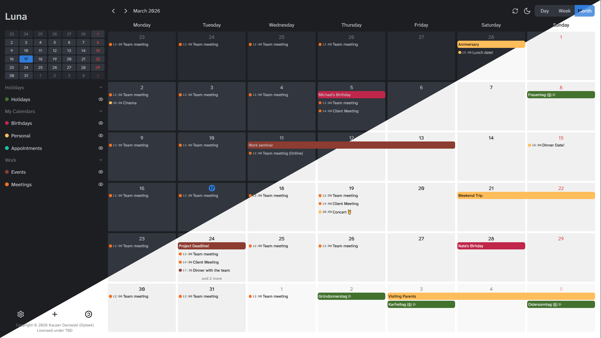
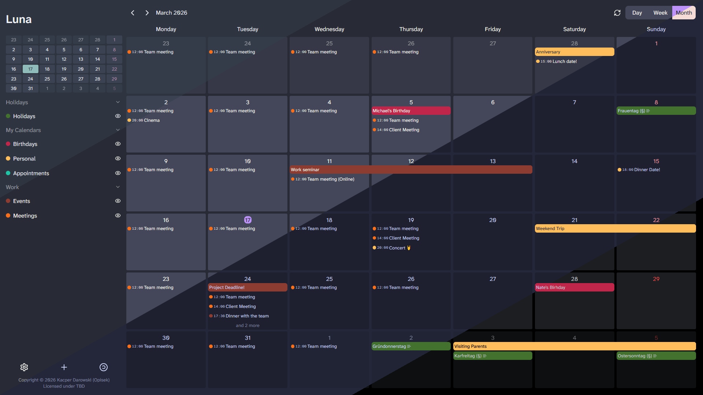

# Luna

📅 Luna is a self-hosted **calendar frontend** and **aggregator**.
- A single web-app for all of your calendars
- Differerent calendar protocols like **CalDav**, **iCal**, and **Google Calendar**
- User management

🎨 Luna is **infinitely customizable**, so your calendar can be as unique as you!
- Completely customizable themes and fonts
- Many built-in themes of popular color schemes
- Simple installation of additional themes and fonts
- Many ways to customize the look of the calendar

# Disclaimer
Luna is an ambitious and large project. As such, development takes a long time.

At this point in time, Luna is nearing a usable 1.0.0 state, however, a lot of small and less small finishing touches still need to be done (in particular, full support for recurring events and mobile screen size support).

Due to my busy schedule and being the sole developer, I am unable to provide a release date for 1.0.0 for now. Feel free to get in contact through GitHub discussions if you are interested in contributing.

You may also follow the progress in the [development roadmap](https://todo.opisek.net/share/dvEazOyRLEYThqxohVosnqKskYLyoZ4nS8rQ63G1/auth?view=280).

# Getting Started

For instruction on how to deploy Luna, see [Deployment Guide](./documentation/deployment.md).

For a list of security mechanisms and compromise analyses, see [Security & Privacy](./documentation/security.md)

For a list of API endpoints, see [API](./documentation/api.md)
